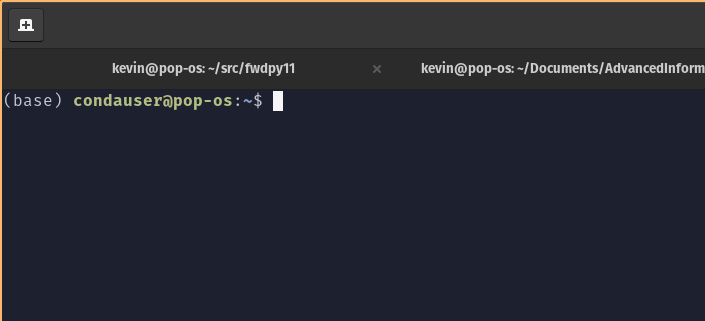

# Week 2: conda and R studio

This week falls under the topic of "dependency management".
Basically, we are setting you up to more easily get stuff done later.

## Goals

* Install R Studio on your machine
* Install a conda system on your machine

## Introduction

You need software on your system to do your work.
Some software comes with your operating system.
But a lot of research software will be "third-party" and you'll have to get it by "some method".

One option is to install from source code.
However, your ability to do this is a function of background/experience and how much access you have to your system.

A popular alternative to installing from code is to use third party "package managers" that have already compiled the code for your system.
The two leaders in this area are:

* [conda](https://docs.conda.io/en/latest/)
* [home brew](https://brew.sh/)

They are superficially similar, but work quite differently.

For R packages, and for report generation, [R studio](https://rstudio.com/) is a key tool.

## R Studio

This one is the easiest:

1. Go to the [website](https://www.rstudio.com).
2. Follow the links to get it for your system.

We do have some possible issues:

* For Windows 10 users, you probably want the Windows 10 installer.
  However, this may or may not be tricky later on when trying to do things like integrate Python!
  You may want to try the Linux installer in your Ubuntu shell and see if that works!!
* If you are on macOS, I think you'll need Xcode in order to install some stuff.

If all else fails, you can try the cloud version in the short term.

## conda

You want the `miniconda` version for your system, found [here](https://docs.conda.io/en/latest/miniconda.html).
You want the **64 bit** version for your platform!!!!!!!!!!!!!!!!!!!!!!!!!!!!!!
You also want **Python 3.8**.

To install, the steps will look something like this (on a Linux machine):

```sh
curl -L https://repo.anaconda.com/miniconda/Miniconda3-latest-Linux-x86_64.sh  > Miniconda3-latest-Linux-x86_64.sh
bash Miniconda3-latest-Linux-x86_64.sh
```

Follow the instructions.
Say "yes" to everything.

Once the install is done, **you must restart your terminal completely**.
Restarting is very important.
If you have successfully installed and restarted, you will see a `(base)` in your command prompt:



### Channels

This is a bio class, so we want bio software!
`conda` uses "channels" to organize packages.
The `bioconda` channel is for bio stuff.

To use `bioconda`, we need to make our environment aware of it.
We follow the instructions [here](http://bioconda.github.io/user/install.html#set-up-channels), which are:

```sh
conda config --add channels defaults
conda config --add channels bioconda
conda config --add channels conda-forge
```

Many users fail to do this!
The symptom is that "really odd stuff" happens when you try to install things and/or run them.

If you have succeeded, your `~/.condarc` file will look exactly like this:

```yaml
channels:
  - conda-forge
  - bioconda
  - defaults
```

To test, let's install something from `bioconda`:

```sh
conda install bwa
```

### What you have now

At this point, you can install stuff from any `conda` channel.
(You may have to add some others, though.)

#### What conda gets you

* The ability to install stuff without having to compile from source.
* You can install without administrative privileges.
* You can install things into different "environments", which we will do in lab this week.

#### What conda does not really give you

Reproducibility!
Some clarification is needed.
Your installation will work *now*, but there is no guarantee that you'll be able to install exactly the same versions of everything later.
However, if you could manually install everything from source, you could completely recreate your environment.

The problem is that `conda` packages update continuously.
This continuous updating means that you are very likely to run into dependency requirements that are impossible to satisfy.

You also *cannot* use `conda` to replicate a computing environment on a different operating system.
There is no guarantee that all the same versions of all the same things exist for all platforms at any given time.
